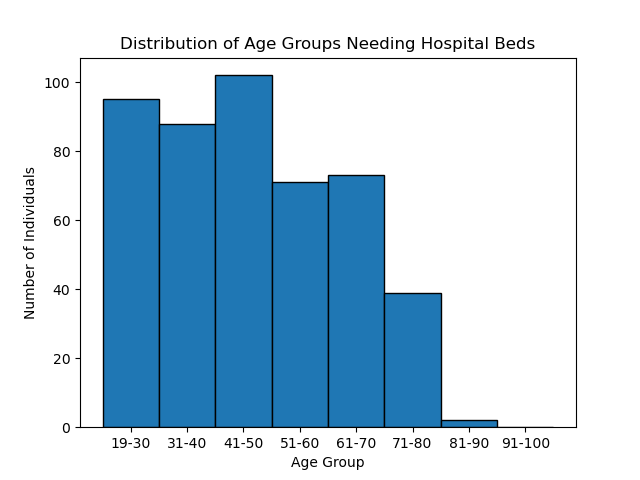

# Introduction

Full project on Predicting the hospitalization urgency of COVID-19 patients using Python. I developed different classification models (KNN & logistic regression) to predict a patient's need for hospitality (target) based on several symptoms and evaluated them by various score metrics, e.g., accuracy, recall, F1-score.

Check the detailled machine learning algorithms out here: [Covid_Hospitalization_Classification](/)

## Problem Setting
At the peak of the COVID-19 pandemic, hospital authorities had to make a call about who to admit and who to send home given the limited available resources. Our problem is to have a classifier that suggests whether a patient should be immediately admitted to the hospital or sent home.

## Goal
The goal of this project is to predict the urgency with which a COVID-19 patient will need to be admitted to the hospital from the time of onset of symptoms. The dataset contains some COVID-19 symptoms and demographic information. Notably, this dataset was collected in the peak of a COVID-19 wave and hence may have some errors and missing data.

While this case study tries to mimic a real-life problem, it is important to note that this analysis is for educational purposes only.

## Background
This in-depth machine learning project resides on my **Capstone project** of the course *[Introduction to Data Science with Python](https://www.edx.org/learn/data-science/harvard-university-introduction-to-data-science-with-python)* taught by Professor Pavlos Protopapas, the Scientific Program director at the Harvard School of Engineering and Applied Sciences (SEAS).

# Tools I Used
For my deep dive into the development of a classification machine learning model of the data, I harnessed the power of several key tools:

- **Python** 
- **Jupyter Notebook**
- **Sklearn**
- **Seaborn**

# The Analysis

### 1. Data Pre-Processing and EDA
To clean and manipulate the COVID-19 data, I used the [Covid_Hospitalization_Classification](/covid.csv.rtf) file, filling missing data using sklearn's ```KNNImputer```, and run an explorative data analysis (EDA).



*Bar chart visualizing the distribution of age groups needing hospital beds*


*Bar chart visualizing the counts of cough by urgency*

Here's the breakdown of the COVID-19 EDA:
- **Patients at risk:** The age group of 41-50 has the most urgent need for a hosphital bed.
- **Feature Selection:** Fever is the most common symptom for urgent hospitalization, followed by cough.
- **Feature Inspection:** Patients with no urgent need of hospitalization have cough as more common symptom than patients with no urgency.

### 2. Train / Test Split 
To split the COVID-19 data, I used the ```train_test_split``` from from *sklearn.model_selection library*. The data is split itno training and a test set of 30% and a random state of 60 for reproducibility.

```python
df_train, df_test = train_test_split(df, test_size=0.3, random_state=60)
```

### 3. Prediction

## Classification Model (KNN)

I use a K-neighbour classifier model with k = 10 to fit and predict the urgency of covid patients.

```python
model = KNeighborsClassifier(n_neighbors = 10)

model.fit(X_train,y_train)
```

```python
y_pred = model.predict(X_test)

```

```python
from sklearn.metrics import accuracy_score

model_accuracy = model.score(X_test, y_test)
print(f"Model Accuracy is {model_accuracy}")
```

The KNN-model accuracy is ~0.691.

### 4. Evaluation

Computing metrics other than accuracy to judge the efficacy of the model's predictions.

**Fit Other Models:**
- Classification model using KNN, with k = 7
- Logistic model using regression, with c = 0.01, where c = inverse of regularization strength

**Evaluation of the New Models:**
Creating a dictionary with different metric scores:
- Accuracy
- Recall
- Specificity
- Precision
- F1-score


| Classification Metric  | Logistic Regression | kNN Classification |
|------------------------|---------------------|--------------------|
| Accuracy               | 62%                 | 62%                |
| Sensitivity/Recall/TPR | 72%                 | 75%                |
| Specificity/TNR        | 50%                 | 47%                |
| Precision              | 62%                 | 62%                |
| F1 Score               | 67%                 | 68%                |

*Overview of evaluation scores across all models.*

``` python
FEATURES = ['dayofyear', 'hour', 'dayofweek', 'quarter', 'month','year',
                'lag1','lag2','lag3']
TARGET = 'PJME_MW'

preds = []
scores = []

for train_idx, val_idx in tss.split(df):
    # this part is the same as above
    
    train = df.iloc[train_idx]
    val = df.iloc[val_idx]

    train = create_features(train)
    val = create_features(val)

    X_train = train[FEATURES]
    y_train = train[TARGET]

    X_val = val[FEATURES]
    y_val = val[TARGET]

    reg = xgb.XGBRegressor(base_score=0.5, booster='gbtree',    
                           n_estimators=1000,
                           early_stopping_rounds=50,
                           objective='reg:squarederror',
                           max_depth=3,
                           learning_rate=0.01)
    reg.fit(X_train, y_train,
            eval_set=[(X_train, y_train), (X_val, y_val)],
            verbose=100)

    y_pred = reg.predict(X_val)
    preds.append(y_pred)
    score = np.sqrt(mean_squared_error(y_val, y_pred))
    scores.append(score)
```


*Feature importance of the model trained*


*Prediction plot over validation data set*

Here's the breakdown of the cross validation:
- **Model training score:** Average score across all folds result in a RMSE of 3682.6647.
- **Feature importance:** Hour and monthly features seem to have larger importance to the model, compared to yearly and the lag3 (i.e., three year lag) features.
- **Validation:** The model seems to slightly underfit the raw data, however, it smoothly captures the treand and seasonality of the validatin set.

### 5. Future Prediction

To predict the future using the trained model, I created a new dataframe for the one-year period ahead using all features (default). However, before creating the new dataframe, I run the machine learning model on the entire PJME energy consumption data set. After concatinating both dataframes, the future data is predicted and plotted using the updated model. Finally, the model is saved for future utilization.

``` python
df = create_features(df)

FEATURES = ['dayofyear', 'hour', 'dayofweek', 'quarter', 'month', 'year',
            'lag1','lag2','lag3']
TARGET = 'PJME_MW'

X_all = df[FEATURES]
y_all = df[TARGET]

reg = xgb.XGBRegressor(base_score=0.5,
                       booster='gbtree',    
                       n_estimators=500,
                       objective='reg:squarederror',
                       max_depth=3,
                       learning_rate=0.01)
reg.fit(X_all, y_all,
        eval_set=[(X_all, y_all)],
        verbose=100)

#Creating forecasting dataframe
future = pd.date_range('2018-08-03','2019-08-01', freq='1h')
future_df = pd.DataFrame(index=future)
future_df['isFuture'] = True
df['isFuture'] = False

df_and_future = pd.concat([df, future_df])
df_and_future = create_features(df_and_future)
df_and_future = add_lags(df_and_future)
```


*Forecasting the future of the energy consumption for the next year*


# What I Learned

Throughout this adventure, I've turbocharged my Data Science toolkit with some serious firepower:
- **Advanced Data Manipulation and Analysis:** I've deepened my proficiency in using Pandas and Numpy for sophisticated data manipulation and analysis, enabling me to prepare and analyze time series data effectively.
- **Data Visualization Mastery:** Through the use of Matplotlib and Seaborn, I've enhanced my skills in creating informative visualizations, which are crucial for understanding time series trends and forecasting results.
- **Machine Learning for Time Series Forecasting:** I've gained hands-on experience with machine learning modeling, specifically using libraries like scikit-learn and XGBoost. This allowed me to build and tune predictive models tailored to forecasting energy consumption.
- **Library Integration and Application:** The project saw the application of a diverse set of Python libraries, including but not limited to sklearn for model building and evaluation, as well as XGBoost for more advanced, ensemble-based modeling techniques. This broadened my exposure to and understanding of Python's data science ecosystem.

# Conclusions

### Insights

The analysis and modeling of energy consumption data have yielded several key insights that are instrumental for understanding consumption patterns, forecasting accuracy, and model performance:
- **Consistency and Seasonality**: The dataset exhibits a clear pattern of consistency and seasonality in energy consumption, ranging from 20,000 MW to nearly 60,000 MW across the years. This pattern includes regular fluctuations that suggest a predictable yearly cycle of energy usage highs and lows.
- **Outlier Detection**: An anomaly was detected at the end of 2010, where energy consumption dropped significantly to 15,000 MW. This outlier could be indicative of external factors affecting energy usage or data collection anomalies and warrants further investigation.
- **Model Performance**: The forecasting model achieved an average Root Mean Square Error (RMSE) of 3682.6647 across all validation folds. This metric indicates the model's prediction accuracy, with a lower RMSE value reflecting closer fit to the actual data points.
- **Feature Importance**: Analysis of feature importance revealed that hourly and monthly attributes significantly influence the model's predictions, more so than yearly trends or the three-year lag feature. This insight suggests that short-term temporal factors play a crucial role in forecasting energy consumption, potentially more than long-term historical patterns.
- **Model Validation**: Despite a tendency to slightly underfit the raw data, the model effectively captures the overarching trend and seasonality within the validation set. This performance indicates a balance between model complexity and its ability to generalize, albeit with room for improvement in fitting the finer details of the dataset.

These insights offer valuable perspectives for refining energy consumption forecasts, highlighting the importance of temporal dynamics and the potential impact of anomalies on predictive accuracy. Further model tuning and investigation into outliers could enhance future forecasting efforts.


### Closing Thoughts


<!--
 
# The Analysis

### 1. Pull & Clean Data
To clean and manipulate the American energy consumption data (PJME), I used the [Forecasting_Energy_Consumption folder](/PJME_hourly.csv) file, set the datetime column to the index of the dataframe, and cleaned the data regarding any outliers.


*Line graph visualizing the US PJME Energy Use in MW, from 2002 to mid of 2018*

Here's the breakdown of the PJME energy consumption:
- **Consistency & Seasonality:** energy consumption, typically, from 20,000 MV to nearly 60,000 MV over all years, consistently, exhibiting recurring up and down swing patterns every year.
- **Outlier:** End of year 2010 shows outliers with 15.000 MW.

### 2. Train / Test Split 
To split the energy consumption data, I used the *TimeSeriesSplit* from from *sklearn.model_selection library*. The data is split using five partitions (folds), exhibiting a one year period for each test data to run multiple fitting rounds on different test sets.

```python
df = df.sort_index()

fig, axs = plt.subplots(5, 1, figsize=(15, 15), sharex=True)

fold = 0
for train_idx, val_idx in tss.split(df):
    train = df.iloc[train_idx]
    test = df.iloc[val_idx]
    train['PJME_MW'].plot(ax=axs[fold],
                          label='Training Set',
                          title=f'Data Train/Test Split Fold {fold}')
    test['PJME_MW'].plot(ax=axs[fold],
                         label='Test Set')
    axs[fold].axvline(test.index.min(), color='black', ls='--')
    fold += 1
plt.savefig("train_test_split_folds")
plt.show()
```


*Data train and test split with one year test size visualizing using five folds (i.e., splits)*

### 3. Feature Creation

The feature creation is based on the time series' index of the energy consumption data, e.g., hourly, monthly, and day of the year features, amongst others. See the following box plot for the MW by month feature, indicating on average higher consumption during the middle of the year.


*Box plot visualizing the ranges of the "MW by month feature"*

In addition, I created three lag features, commonly used in time series data, including one, two, and three years data shifts from the original PJME energy consumption data.

### 4. Train Using Cross Validation

``` python
FEATURES = ['dayofyear', 'hour', 'dayofweek', 'quarter', 'month','year',
                'lag1','lag2','lag3']
TARGET = 'PJME_MW'

preds = []
scores = []

for train_idx, val_idx in tss.split(df):
    # this part is the same as above
    
    train = df.iloc[train_idx]
    val = df.iloc[val_idx]

    train = create_features(train)
    val = create_features(val)

    X_train = train[FEATURES]
    y_train = train[TARGET]

    X_val = val[FEATURES]
    y_val = val[TARGET]

    reg = xgb.XGBRegressor(base_score=0.5, booster='gbtree',    
                           n_estimators=1000,
                           early_stopping_rounds=50,
                           objective='reg:squarederror',
                           max_depth=3,
                           learning_rate=0.01)
    reg.fit(X_train, y_train,
            eval_set=[(X_train, y_train), (X_val, y_val)],
            verbose=100)

    y_pred = reg.predict(X_val)
    preds.append(y_pred)
    score = np.sqrt(mean_squared_error(y_val, y_pred))
    scores.append(score)
```


*Feature importance of the model trained*


*Prediction plot over validation data set*

Here's the breakdown of the cross validation:
- **Model training score:** Average score across all folds result in a RMSE of 3682.6647.
- **Feature importance:** Hour and monthly features seem to have larger importance to the model, compared to yearly and the lag3 (i.e., three year lag) features.
- **Validation:** The model seems to slightly underfit the raw data, however, it smoothly captures the treand and seasonality of the validatin set.

### 5. Future Prediction

To predict the future using the trained model, I created a new dataframe for the one-year period ahead using all features (default). However, before creating the new dataframe, I run the machine learning model on the entire PJME energy consumption data set. After concatinating both dataframes, the future data is predicted and plotted using the updated model. Finally, the model is saved for future utilization.

``` python
df = create_features(df)

FEATURES = ['dayofyear', 'hour', 'dayofweek', 'quarter', 'month', 'year',
            'lag1','lag2','lag3']
TARGET = 'PJME_MW'

X_all = df[FEATURES]
y_all = df[TARGET]

reg = xgb.XGBRegressor(base_score=0.5,
                       booster='gbtree',    
                       n_estimators=500,
                       objective='reg:squarederror',
                       max_depth=3,
                       learning_rate=0.01)
reg.fit(X_all, y_all,
        eval_set=[(X_all, y_all)],
        verbose=100)

#Creating forecasting dataframe
future = pd.date_range('2018-08-03','2019-08-01', freq='1h')
future_df = pd.DataFrame(index=future)
future_df['isFuture'] = True
df['isFuture'] = False

df_and_future = pd.concat([df, future_df])
df_and_future = create_features(df_and_future)
df_and_future = add_lags(df_and_future)
```


*Forecasting the future of the energy consumption for the next year*


# What I Learned

Throughout this adventure, I've turbocharged my Data Science toolkit with some serious firepower:
- **Advanced Data Manipulation and Analysis:** I've deepened my proficiency in using Pandas and Numpy for sophisticated data manipulation and analysis, enabling me to prepare and analyze time series data effectively.
- **Data Visualization Mastery:** Through the use of Matplotlib and Seaborn, I've enhanced my skills in creating informative visualizations, which are crucial for understanding time series trends and forecasting results.
- **Machine Learning for Time Series Forecasting:** I've gained hands-on experience with machine learning modeling, specifically using libraries like scikit-learn and XGBoost. This allowed me to build and tune predictive models tailored to forecasting energy consumption.
- **Library Integration and Application:** The project saw the application of a diverse set of Python libraries, including but not limited to sklearn for model building and evaluation, as well as XGBoost for more advanced, ensemble-based modeling techniques. This broadened my exposure to and understanding of Python's data science ecosystem.

# Conclusions

### Insights

The analysis and modeling of energy consumption data have yielded several key insights that are instrumental for understanding consumption patterns, forecasting accuracy, and model performance:
- **Consistency and Seasonality**: The dataset exhibits a clear pattern of consistency and seasonality in energy consumption, ranging from 20,000 MW to nearly 60,000 MW across the years. This pattern includes regular fluctuations that suggest a predictable yearly cycle of energy usage highs and lows.
- **Outlier Detection**: An anomaly was detected at the end of 2010, where energy consumption dropped significantly to 15,000 MW. This outlier could be indicative of external factors affecting energy usage or data collection anomalies and warrants further investigation.
- **Model Performance**: The forecasting model achieved an average Root Mean Square Error (RMSE) of 3682.6647 across all validation folds. This metric indicates the model's prediction accuracy, with a lower RMSE value reflecting closer fit to the actual data points.
- **Feature Importance**: Analysis of feature importance revealed that hourly and monthly attributes significantly influence the model's predictions, more so than yearly trends or the three-year lag feature. This insight suggests that short-term temporal factors play a crucial role in forecasting energy consumption, potentially more than long-term historical patterns.
- **Model Validation**: Despite a tendency to slightly underfit the raw data, the model effectively captures the overarching trend and seasonality within the validation set. This performance indicates a balance between model complexity and its ability to generalize, albeit with room for improvement in fitting the finer details of the dataset.

These insights offer valuable perspectives for refining energy consumption forecasts, highlighting the importance of temporal dynamics and the potential impact of anomalies on predictive accuracy. Further model tuning and investigation into outliers could enhance future forecasting efforts.


### Closing Thoughts

This project underscores the dynamic and multifaceted nature of energy consumption forecasting. The insights derived not only show the path towards more accurate models but also highlight the critical role of temporal analysis and anomaly investigation in enhancing energy management strategies.
-->


<!-- To emphasize the problem of relying on a single metric such as accuracy for prediction, we’ll compare scenarios from different countries’ COVID-19 response.

Problem Setting
At the peak of the COVID-19 pandemic, hospital authorities had to make a call about who to admit and who to send home given the limited available resources. Our problem is to have a classifier that suggests whether a patient should be immediately admitted to the hospital or sent home.

The Data
The data use the following primary predictors:

age
sex
cough, fever, chills, sore throat, headache, fatigue
The outcome is a classification prediction to indicate the urgency of admission.

Positive: indicates a patient that was admitted within 1 day from the onset of symptoms.
Negative: indicates everyone else.
 Issues
While this case study tries to mimic a real-life problem, it is important to note that this analysis is for educational purposes only.

The data is sourced through online forms and thus is of questionable accuracy.
A large portion of the original dataset collected had missing values. This was ignored for a simpler analysis.
The entire premise of predicting urgency of admission is false because some people had to wait longer to be admitted because of lack of hospital beds and resources.
For this problem setting, we examine two different models: Logistic Regression and kNN Classification. The goal is to train both these models and report the accuracy.

| Classification Metric  | Logistic Regression | kNN Classification |
|------------------------|---------------------|--------------------|
| Accuracy               | 62%                 | 62%                |
| Sensitivity/Recall/TPR | 72%                 | 75%                |
| Specificity/TNR        | 50%                 | 47%                |
| Precision              | 62%                 | 62%                |
| F1 Score               | 67%                 | 68%                |
-->

Readme in progress.
